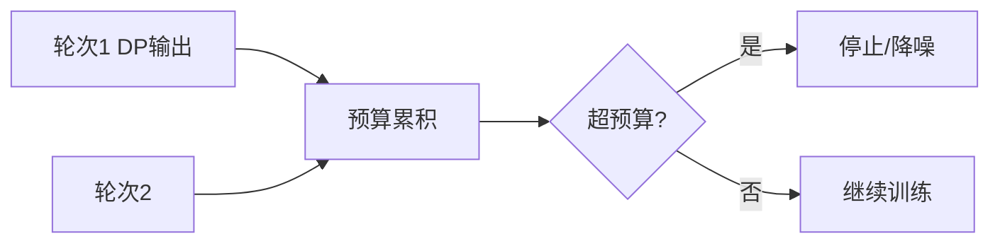

# P13 【Umich】在线学习与查分隐私之间的联系

← [[BV1q4421A72h-总览]] | ← [[P12-SimonsInstitute联邦学习&协作学习]] | 下一篇 → [[P14-ICML_22PeterRichtarik联邦学习中本地梯度步骤可证明导致通信加速]]

## 视频信息

| 项目 | 内容 |
|------|------|
| 分集 | 【Umich】在线学习与查分隐私之间的联系 |
| 模块 | 在线学习与差分隐私 |
| 时长 | 79 分 03 秒 |
| 链接 | [B 站 P13](https://www.bilibili.com/video/BV1q4421A72h?p=13) |
| 内容来源 | 教程级知识点增强（非 UP 逐字转写） |

## 核心要点

1. **本 P 主题**：【Umich】在线学习与查分隐私之间的联系
2. **模块定位**：在线学习与差分隐私
3. **研读侧重**：OCO 遗憾、联邦 DP 组合、RDP 会计
4. **笔记层级**：教程级（约 2706 字），含速览、Mermaid、Walkthrough、自测题
5. **学习建议**：先读「3 分钟速览」与「图解」，再深入「详细讲解」

> 以下内容基于联邦学习、差分隐私与协作学习理论体系撰写，对应 B 站分 P「【Umich】在线学习与查分隐私之间的联系」。**非 UP 逐字转写**；不看视频可建立框架，看视频对照「与视频对照表」。

## 本节在系列中的位置

**模块**：差分隐私理论 · **P13/15**（Umich 长讲座 ~79min）。

**前置**：[[P06-带有正式用户级差分隐私保证的联邦学习]]。

**后续**：深化 DP 会计；与联邦实践交叉验证。

## 3 分钟速览

在线学习与差分隐私联系：OCO 遗憾界、自适应对手、联邦多轮=在线组合、RDP/PLD 会计、高维投影。理论深线。

## 零基础导读

本集数学密度高。目标不是手推全部定理，而是理解**为何联邦 DP 必须做组合会计**、**遗憾界如何指导噪声尺度**、**高维为何伤害效用**。

## 详细讲解

### 1. 在线学习与差分隐私的桥梁（Umich 讲座）

**在线学习**：数据流逐轮到达，算法每轮输出决策，损失事后揭示（专家问题、老虎机、在线凸优化）。**差分隐私在线学习**：每轮输出需满足 DP，且隐私预算随轮次累积。本集揭示二者在**组合、自适应对手、维数**上的深刻联系。

### 2. 在线凸优化（OCO）框架

每轮 $t=1..T$：
1. 算法选 $w_t \in \mathcal{K}$
2. 对手揭示凸损失 $f_t$
3. 支付 $f_t(w_t)$

目标：最小化**遗憾** $\text{Regret}_T = \sum_t f_t(w_t) - \min_{w\in\mathcal{K}} \sum_t f_t(w)$。

经典算法：OGD、FTRL、AdaGrad。

### 3. DP 在线学习的难点

| 难点 | 说明 |
|------|------|
| 自适应对手 | 损失依赖历史输出，隐私分析更紧 |
| 组合 | $T$ 轮每轮 $\varepsilon_t$，总预算管理 |
| 高维 | 噪声范数随维度 $d$ 增长，效用下降 |
| 连续发布 | 统计查询流（热图、趋势） |

### 4. 与联邦学习的对应

联邦学习每轮通信可视为**在线协议的一轮**：
- 全局模型 $w_t$ 是「决策」
- 客户端损失是「对手」或随机采样
- DP-FedAvg 是「带 DP 的在线更新」

**联系定理直觉**：联邦 DP 会计可借用在线 DP 的**高级组合**与**shuffle 放大**技术。

### 5. 经典结果方向（讲座可能覆盖）

- **DP-SGD 遗憾界**：在 Lipschitz 条件下，$\text{Regret}_T = \tilde{O}(\sqrt{T}/\varepsilon)$
- **维数约减**：Johnson-Lindenstrauss 投影降维后加噪
- **私人学习理论**：可学习性在 DP 约束下是否保持
- **自适应数据收集**：探索-利用与隐私双重约束

### 6. 隐私会计工具

| 工具 | 用途 |
|------|------|
| Moments Accountant | 深度学习 DP 训练 |
| Rényi DP | 紧组合 |
| PLD (Privacy Loss Distribution) | 精确会计 |
| zCDP | 分析友好 |

联邦多轮训练必须用**会计器**追踪累计 $(\varepsilon,\delta)$，不能每轮独立设 $\varepsilon$。

### 7. 实践启示

- 高维模型联邦 DP：考虑**投影 DP**、**低秩更新 DP**
- 在线 API 发布统计：用**阈值机制**或**稀疏向量技术**
- 设定**全局预算**而非每轮相同 $\varepsilon$

### 8. Walkthrough：联邦场景套用在线 DP 思维

1. 定义 $T$ 轮通信，每轮采样率 $q$
2. 选 RDP 会计，输入噪声 $\sigma$、裁剪 $C$
3. 模拟精度-隐私曲线，找可接受 $\varepsilon_{\text{total}}$
4. 若维度过高，评估 JL 投影或只 DP 最后一层
5. 文档化隐私声明与预算耗尽策略

### 9. 本集学习要点

- 定义在线遗憾 Regret
- 说明联邦多轮训练为何是在线组合问题
- 列举一种隐私会计工具及其作用

### 高维联邦 DP 策略

| 策略 | 适用 |
|------|------|
| 只 DP 最后一层 | 特征已抽象 |
| LoRA 低秩 DP | 大模型联邦 |
| 投影 DP | 极高维梯度 |

## 图解

## 类比与直觉

在线 DP 像**每天发布新闻但承诺不暴露任何个体**：每多发布一期，隐私预算就多花一点，必须记账本（会计器）防止超支。

## 例题与场景 Walkthrough

**联邦训练 DP 会计纸面流程**

1. 定 $T$ 轮、采样率 $q$、目标 $(\varepsilon,\delta)$。
2. 选 RDP 会计，二分搜索噪声 $\sigma$。
3. 画测试精度 vs $\varepsilon$ 曲线。
4. 若 $d$ 过大：试投影 DP 或层-wise DP。
5. 文档化预算耗尽策略。

## 常见误区

1. **在线=联邦完全相同**：类比有用但假设需核对。
2. **会计一次即可**：数据分布变需重算。
3. **维数无害**：高维噪声范数大，效用降。

## 与视频对照表

| 视频段落（约） | 预期演示内容 | 笔记对应章节 |
|-------------|------------|------------|
| 开篇 0%–15% | 本集目标、背景、与前后集关系 | 本节位置、3 分钟速览 |
| 前段 15%–40% | 核心概念定义与架构图 | 零基础导读、详细讲解 |
| 中段 40%–70% | 原理展开、对比、政策/代码示例 | 图解、类比、Walkthrough |
| 后段 70%–90% | 案例、问答、易错点 | 常见误区、Checklist |
| 收尾 90%–100% | 总结、延伸资源 | 延伸阅读、自测题 |

> 本集总时长约 **79分03秒**。无官方外挂字幕时，以分 P 标题「【Umich】在线学习与查分隐私之间的联系」与上表主题对齐视频画面。

## 动手实践 Checklist

- [ ] 读 Opacus 会计文档
- [ ] 解释遗憾界中 $1/\varepsilon$ 角色
- [ ] 列 3 种会计工具
- [ ] 写联邦-在线类比短文
- [ ] 自测

## 延伸阅读

- Dwork & Roth, Algorithmic Foundations of DP
- Mironov, Rényi DP
- [[P06-带有正式用户级差分隐私保证的联邦学习]]

## 自测题

1. **Regret 定义？**  **答**：在线损失和减最优固定 $w$ 损失和。
2. **联邦为何是在线组合？**  **答**：多轮迭代每轮消耗隐私预算。
3. **RDP 优势？**  **答**：组合紧，便于深度学习会计。
4. **JL 投影？**  **答**：降维后加噪减范数伤害。
5. **与 P06？**  **答**：P06 实践，P13 理论组合。

## 关键术语

| 术语 | 说明 |
|------|------|
| 联邦学习 FL | 数据不出本地，协作训练全局模型 |
| 差分隐私 DP | 单条记录变化对输出分布影响有界 |
| Regret | 在线损失相对最优静态决策 |
| RDP | Rényi 差分隐私 |

## 与前后分 P 的衔接

- ← **【Simons Institute】联邦学习&协作学习 (6)**（[[P12-SimonsInstitute联邦学习&协作学习]]）
- → **【ICML_22】【Peter Richtarik】联邦学习中本地梯度步骤可证明导致通信加速**（[[P14-ICML_22PeterRichtarik联邦学习中本地梯度步骤可证明导致通信加速]]）

## 逐字转写

> 状态：待转写。运行 `Tools/transcribe/transcribe.ps1 -Bvid BV1q4421A72h -Part 13` 补充。

## 来源说明

- ✅ B 站官方元数据（`Tools/BV1q4421A72h-full.json`）
- ✅ 分 P 首帧封面（`Tools/bili-fetch/fetch-bilibili.js`）
- ✅ **教程级增强**：含 Mermaid、Walkthrough、自测题（约 2706 字，2026-06-06）
- ⏳ 逐字转写：B 站 API 无外挂字幕轨；可选 Whisper/BiliNote 后续补充

## 关键截图

![[../../06-资源附件/video-notes-images/BV1q4421A72h-P13-cover.jpg|B站首帧 P13]]
