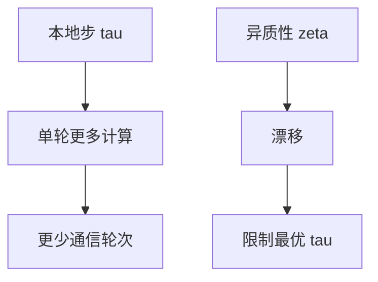

# P14 【ICML_22】【Peter Richtarik】联邦学习中本地梯度步骤可证明导致通信加速

← [[BV1q4421A72h-总览]] | ← [[P13-Umich在线学习与查分隐私之间的联系]] | 下一篇 → [[P15-NeurIPS_21AnOnlineRiemannianPCAforStochasticC]]

## 视频信息

| 项目 | 内容 |
|------|------|
| 分集 | 【ICML_22】【Peter Richtarik】联邦学习中本地梯度步骤可证明导致通信加速 |
| 模块 | 前沿论文 |
| 时长 | 64 分 35 秒 |
| 链接 | [B 站 P14](https://www.bilibili.com/video/BV1q4421A72h?p=14) |
| 内容来源 | 教程级知识点增强（非 UP 逐字转写） |

## 核心要点

1. **本 P 主题**：【ICML_22】【Peter Richtarik】联邦学习中本地梯度步骤可证明导致通信加速
2. **模块定位**：前沿论文
3. **研读侧重**：Local GD 通信加速、最优 $\tau$、异质性 $\zeta$
4. **笔记层级**：教程级（约 2777 字），含速览、Mermaid、Walkthrough、自测题
5. **学习建议**：先读「3 分钟速览」与「图解」，再深入「详细讲解」

> 以下内容基于联邦学习、差分隐私与协作学习理论体系撰写，对应 B 站分 P「【ICML_22】【Peter Richtarik】联邦学习中本地梯度步骤可证明导致通信加速」。**非 UP 逐字转写**；不看视频可建立框架，看视频对照「与视频对照表」。

## 本节在系列中的位置

**模块**：前沿论文 · **P14/15**（ICML 2022, Richtárik）。

**前置**：[[P03-IntroductiontoFederatedLearning]]、[[P11-【SimonsInstitute】联邦学习&协作学习5SurveyonOptimizationinFL]]。

**后续**：与 [[P04-联邦学习中的高效通信优化方法]] 联合指导调 $E$。

## 3 分钟速览

本地梯度步**可证明**通信加速：Local GD 分析、最优 $\tau$、异质性 $\zeta$ 限制、与 FedAvg 实践对照。

## 零基础导读

本集是**理论课**。抓住结论：存在本地步数甜点，使通信轮次减少且仍有收敛保证；异质性强时甜点左移（减小 $\tau$）。

## 详细讲解

### 1. 论文背景（ICML 2022, Peter Richtárik）

**核心问题**：联邦学习中每轮只传一次更新，但客户端本地跑了 $E>1$ 步梯度下降。直觉上本地步应减少通信，但**能否证明**在相同精度下通信轮次严格减少？本集讲解**本地梯度步可证明导致通信加速**的理论结果。

### 2. 本地 SGD / Local GD 模型

每轮：
1. 广播 $w_t$
2. 各客户端从 $w_t$ 出发，执行 $E$ 步本地 GD：$w_t^k \leftarrow w_t - \eta \sum_{e=1}^E \nabla f_k(w)$
3. 聚合 $w_{t+1} = \frac{1}{K}\sum_k w_t^k$（或加权）

关键量：**本地步数 $\tau$（或 $E$）**、**步长 $\eta$**、**异质性**。

### 3. 通信加速的含义

设达到 $\varepsilon$-精度：
- **中心化 GD**：需 $T_{\text{center}}$ 次梯度评估
- **联邦 Local GD**：每轮一次通信 + $K$ 个客户端各 $\tau$ 本地步

**加速**：存在参数使联邦方案通信轮次
$$T_{\text{FL}} \ll T_{\text{center}} / \tau$$
且在非凸光滑条件下仍有保证（论文给出显式界）。

### 4. 直觉：为何本地步有用

同质数据时，本地多步近似**全局梯度方向**，一次通信抵多次中心化小步。异质时漂移恶化，需配合：
- 小步长 $\eta$
- 近端/控制变量（联系 FedProx、SCAFFOLD）
- 适当 $\tau$ 而非盲目增大

### 5. 理论假设（典型）

- $f_k$ 光滑（$L$-Lipschitz 梯度）
- 可能凸或非凸
- 有界异质性：$\|\nabla f_k(w) - \nabla f(w)\| \le \zeta$
- 全参与或均匀采样

结论形式（示意）：
$$\mathbb{E}\|\nabla f(\hat{w})\|^2 \le \frac{C_1}{T} + \frac{C_2 \tau \zeta^2}{T} + \cdots$$

选 $\tau \approx \sqrt{T}$ 或常数可平衡两项——**存在最优本地步数**。

### 6. 与 FedAvg 实践对照

| 实践观察 | 理论解释 |
|----------|----------|
| $E=1$ 通信多 | 未利用本地加速 |
| $E$ 过大发散 | 漂移项 $C_2\tau\zeta^2$ 主导 |
| 调 $E$ 有甜点 | 对应定理最优 $\tau$ |

### 7. 算法设计启示

1. **自适应 $\tau$**：早期大 $\tau$ 快速下降，后期减 $\tau$ 精调
2. **异质性感知**：估计 $\zeta$ 动态调本地步
3. **与压缩正交**：先证加速再叠量化（注意分析组合）

### 8. 证明技术一瞥（不需手推）

常用：**势函数** $w_t - w^*$ 距离 + **梯度平方和**，利用本地 GD 线性收敛块与聚合平均方差缩减。Richtárik 组工作常连接 **随机梯度、方差缩减、联邦** 统一框架。

### 9. 本集学习要点

- 陈述「本地步通信加速」定理含义
- 解释异质性 $\zeta$ 如何限制最优 $\tau$
- 对照 P04 工程技巧与 P11 优化综述

### 自适应 $\tau$ 策略（启发式）

- 训练前期：较大 $\tau$ 快速下降
- 中后期：减 $\tau$ 精调
- 监控客户端梯度余弦相似度，低则减 $\tau$

## 图解

## 类比与直觉

本地步像**在家多练几套题再去老师那儿对答案**：对得多（同质）就少跑几趟学校（通信）；各自练偏了（异质）就得少练几次、多对答案。

## 例题与场景 Walkthrough

**读定理三步**

1. 写假设：光滑、异质 $\zeta$、参与方式。
2. 标 $T$（通信轮次）与 $\tau$（本地步）关系。
3. 代 $\zeta=0$（IID）与 $\zeta$ 大对比最优 $\tau$。

## 常见误区

1. **证明加速=任意 $E$ 都好**：过大仍发散。
2. **忽视采样**：部分参与改变界。
3. **与压缩定理自动组合**：联合分析非平凡。

## 与视频对照表

| 视频段落（约） | 预期演示内容 | 笔记对应章节 |
|-------------|------------|------------|
| 开篇 0%–15% | 本集目标、背景、与前后集关系 | 本节位置、3 分钟速览 |
| 前段 15%–40% | 核心概念定义与架构图 | 零基础导读、详细讲解 |
| 中段 40%–70% | 原理展开、对比、政策/代码示例 | 图解、类比、Walkthrough |
| 后段 70%–90% | 案例、问答、易错点 | 常见误区、Checklist |
| 收尾 90%–100% | 总结、延伸资源 | 延伸阅读、自测题 |

> 本集总时长约 **64分35秒**。无官方外挂字幕时，以分 P 标题「【ICML_22】【Peter Richtarik】联邦学习中本地梯度步骤可证明导致通信加速」与上表主题对齐视频画面。

## 动手实践 Checklist

- [ ] 读论文 Abstract+Theorem 1
- [ ] 画 $\tau$ vs 收敛示意草图
- [ ] 对照 FedAvg 调 $E$ 实验设计
- [ ] 在 P11 表标注 Local GD
- [ ] 自测

## 延伸阅读

- Mishchenko et al., ProxSkip / Local GD 系列
- Richtárik 组联邦优化论文列表
- [[P04-联邦学习中的高效通信优化方法]]

## 自测题

1. **通信加速指什么？**  **答**：同精度下通信轮次更少。
2. **$\tau$ 过大后果？**  **答**：漂移项增大，收敛变差。
3. **Richtárik 贡献？**  **答**：Local GD 通信复杂度可证界。
4. **实践启示？**  **答**：自适应 $\tau$、异质性感知。
5. **与 P04？**  **答**：P14 减轮次，P04 减每轮比特。

## 关键术语

| 术语 | 说明 |
|------|------|
| 联邦学习 FL | 数据不出本地，协作训练全局模型 |
| 差分隐私 DP | 单条记录变化对输出分布影响有界 |
| Local GD | 每轮多步本地梯度下降 |
| 通信加速 | 同精度更少轮次 |

## 与前后分 P 的衔接

- ← **【Umich】在线学习与查分隐私之间的联系**（[[P13-Umich在线学习与查分隐私之间的联系]]）
- → **【NeurIPS_21】An Online Riemannian PCA for Stochastic CCA**（[[P15-NeurIPS_21AnOnlineRiemannianPCAforStochasticC]]）

## 逐字转写

> 状态：待转写。运行 `Tools/transcribe/transcribe.ps1 -Bvid BV1q4421A72h -Part 14` 补充。

## 来源说明

- ✅ B 站官方元数据（`Tools/BV1q4421A72h-full.json`）
- ✅ 分 P 首帧封面（`Tools/bili-fetch/fetch-bilibili.js`）
- ✅ **教程级增强**：含 Mermaid、Walkthrough、自测题（约 2777 字，2026-06-06）
- ⏳ 逐字转写：B 站 API 无外挂字幕轨；可选 Whisper/BiliNote 后续补充

## 关键截图

![[../../06-资源附件/video-notes-images/BV1q4421A72h-P14-cover.jpg|B站首帧 P14]]
